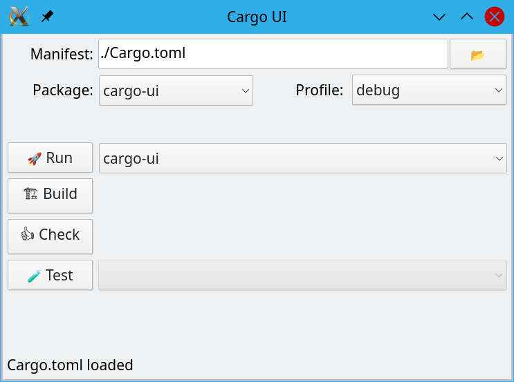

# A GUI for Cargo

This is a project to make a GUI for cargo



## The idea

```sh
cargo install cargo-ui
cargo ui
```

## Style

The default style from SixtyFPS is the `ugly` style. But the interface looks much
nicer using the `native` style as this has native controls and images.

To install using the native style, use

```sh
SIXTYFPS_STYLE=native cargo install
```

The use of the native style require Qt 5.15, see https://github.com/sixtyfpsui/sixtyfps/blob/master/docs/install_qt.md


## Vision

Some idea of feature

 - [x] choose the binary to run or the lib to build or the test to run
 - [x] Display the errors in a nice way
 - [x] select the debug or release mode
 - [ ] select the toolchain (nightly, stable, ...)
 - [ ] maybe integrate with rustup to update the toolchain or  install new one
 - [ ] See the dependencies as an expendable tree
 - [ ] Show duplicated dependencies
 - [ ] Show outdated dependencies, with button to easily update
 - [ ] Ability to easily add dependency (by searching the crates.io index)
 - [ ] edit features of dependencies from a list.
 - [ ] show asm, llvm-ir, ...
 - [ ] show build progress and be able to cancel the build
 - [ ] also edit other metadata of the the Cargo.toml (edition, author, ...)
 - [ ] manage workspace and do batch edit of the metadata on all members
 - [ ] Have a "playground" tab which allow to easily try rust code
 - [ ] a publish tab which publish all the crate in the workspace in the right order
 - [ ] Double-click on a `Cargo.toml` file would also run cargo-ui.
 - [ ] ...

## License

The source code of Cargo UI is available under the terms of both the MIT license
and the Apache License (Version 2.0).
(See [LICENSE-APACHE](LICENSE-APACHE) and [LICENSE-MIT](LICENSE-MIT) for details.)

However, because of the use of GPL dependencies, cargo-ui, as a whole, is licensed
under the terms of the GPLv3 (See [LICENSE-GPL](LICENSE-GPL))
