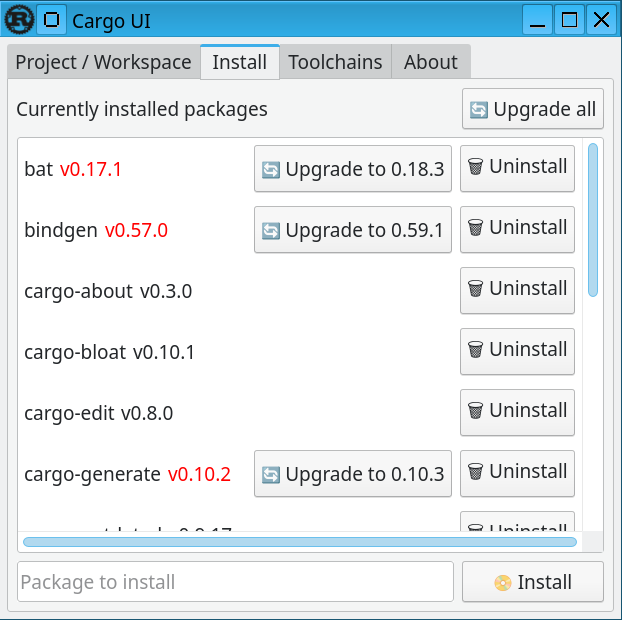

# A GUI for Cargo

[](https://github.com/sixtyfpsui/cargo-ui/actions)
[](https://deps.rs/repo/github/sixtyfpsui/cargo-ui)

This is a project to make a GUI for cargo, built using [Slint](https://github.com/sixtyfpsui/sixtyfps):

## Screnshots

|  |  |  |
| ---- | ---- | ---- | 


## Installation

Cargo UI can be installed from crates.io:

```sh
cargo install cargo-ui
```

Alternatively, you can download one of our pre-built binaries for Linux or Windows:

1. Open <https://github.com/sixtyfpsui/cargo-ui/releases>
2. Click on the latest release
3. From "Assets" download either `cargo-ui-linux.tar.gz` for a Linux x86-64 binary
   or `cargo-ui-windows.zip` for a Windows x86-64 binary.
4. Uncompress the downloaded archive and run `cargo-ui`/`cargo-ui.exe` or place the
   uncompressed directory into your `PATH`.

## Usage

```sh
cargo ui
```

## Prerequisites

In addition to a working cargo and Rust installation, a few other tools or libraries are needed:

Linux:

 * fontconfig library (`libfontconfig-dev` on debian based distributions)
 * xcb library (`libxcb-shape0-dev libxcb-xfixes0-dev libxkbcommon-dev` on debian based distributions)

Windows:

 * A working C compiler (such as MSVC)

macOS:
 *  "Xcode Command Line Tools" need to be installed: `xcode-select --install`


**For the native style**:  (optional)
 * The native style requires Qt >= 5.15, see <https://github.com/sixtyfpsui/sixtyfps/blob/master/docs/install_qt.md>.
   If Qt is not present while building, the *fluent* style will be used as a fallback.

## Vision

Some ideas for features:

 - [x] Choose the binary to run or the lib to build or the test to run
 - [x] Display the errors in a nice way
 - [x] Select the debug or release mode
 - [ ] Select the toolchain (nightly, stable, ...)
 - [ ] Maybe integrate with rustup to update the toolchain or install new one
 - [x] See the dependencies as an expendable tree
 - [ ] Show duplicated dependencies
 - [x] Show outdated dependencies, with button to easily update
 - [x] Ability to easily add dependency (by searching the crates.io index)
 - [ ] Edit features of dependencies from a list.
 - [ ] Show asm, llvm-ir, ...
 - [ ] Show build progress and be able to cancel the build
 - [ ] Edit other metadata of the the Cargo.toml (edition, author, ...)
 - [ ] Manage workspaces and do batch edit of the metadata on all members
 - [ ] Have a "playground" tab which allow to easily try rust code
 - [ ] A publish tab which publishes all the crates in the workspace in the right order
 - [ ] Double-click on a `Cargo.toml` file would also run cargo-ui.
 - [ ] ...

## License

The source code of Cargo UI is available under the terms of both the MIT license
and the Apache License (Version 2.0).
(See [LICENSE-APACHE](LICENSE-APACHE) and [LICENSE-MIT](LICENSE-MIT) for details.)

However, because of the use of GPL dependencies, cargo-ui, as a whole, is licensed
under the terms of the GPLv3 (See [LICENSE-GPL](LICENSE-GPL))
